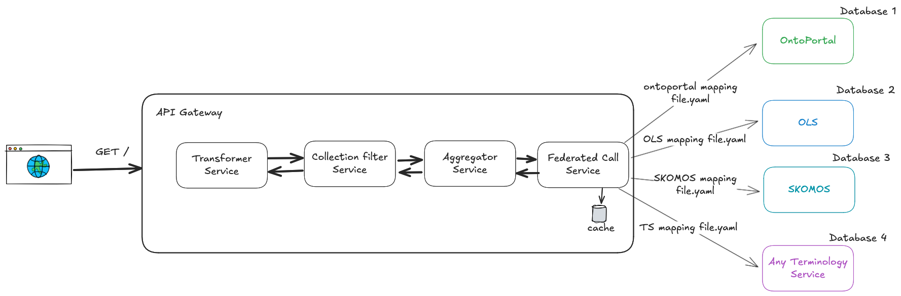

# TS4NFDI Federated Service - API-Gateway

## Overview

The TS4NFDI Federated Service is an advanced, dynamic solution designed to perform federated calls across multiple Terminology Services (TS) within NFDI. It is particularly tailored for environments where integration and aggregation of diverse data sources are essential. The service offers search capabilities, enabling users to refine search results based on specific criteria, and supports responses in both JSON and JSON-LD formats.

A standout feature of this service is its dynamic nature, governed by a JSON configuration file. This design choice allows for easy extension and customization of the service to include new TS or modify existing configurations.

## Features

- **Federated Search Across Multiple Terminology Services:** Seamlessly query multiple TS simultaneously and aggregate results into a unified format.
- **Parametrisable Search Capabilities:** Filter and refine search results based on specific criteria, enhancing the search experience and relevance of results.
- **Dynamic Configuration:** Utilize a JSON file to configure TS connections and response mappings, enabling easy addition or modification of terminology sources.
- **Response Format Flexibility:** Choose between standard JSON and JSON-LD formats for search results, covering different use cases and requirements.
- **Schema Transformation:** Convert search responses into specific TS output formats, facilitating integration with existing systems.

  
  

## Installation

To set up the API-Gateway, follow these steps:

1. Clone the repository to your local machine:
   `git clone https://github.com/ts4nfdi/api-gateway.git`
2. In your command line navigate to the project directory:
   `cd api-gateway`
3. Run docker-compose to start the API Gateway and its dependencies:
   `docker compose --profile all up --build`
The service will be accessible at `http://localhost:8080/api-gateway` by default.

## Extensibility and Customization

The service's dynamic configuration approach allows for straightforward extensibility. Adding a new TS or modifying an existing one involves updating the JSON configuration file with the relevant details and mappings. This flexibility ensures that the service can adapt to evolving data sources and requirements without the need for significant code changes.

#### Steps to Integrate a New TS Schema:

1. **Add a new Mapping Configuration file:** Create a new YAML file in the `src/main/resources/backend_types` directory. This file should define the mapping between the new TS schema and the API Gateway schema. See the existing mapping files for examples of how to structure this file.
2. **Add your database URL:** edit the `src/main/resources/sources.json` file to add the new TS database URL. This file contains the connection details for all the TS databases that the API Gateway will connect to.
