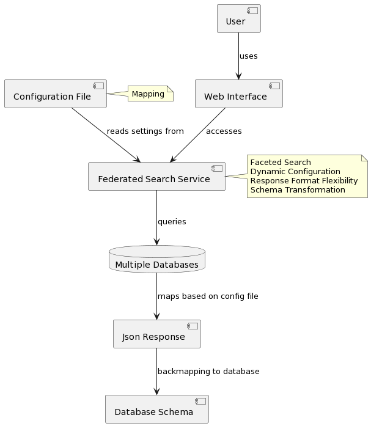

# TS4NFDI Federated Service - API-Gateway

## Overview

The TS4NFDI Federated Service is an advanced, dynamic solution designed to perform federated calls across multiple Terminology Services (TS) within NFDI. It is particularly tailored for environments where integration and aggregation of diverse data sources are essential. The service offers search capabilities, enabling users to refine search results based on specific criteria, and supports responses in both JSON and JSON-LD formats.

A standout feature of this service is its dynamic nature, governed by a JSON configuration file. This design choice allows for easy extension and customization of the service to include new TS or modify existing configurations.

## Features

- **Federated Search Across Multiple Terminology Services:** Seamlessly query multiple TS simultaneously and aggregate results into a unified format.
- **Parametrisable Search Capabilities:** Filter and refine search results based on specific criteria, enhancing the search experience and relevance of results.
- **Dynamic Configuration:** Utilize a JSON file to configure TS connections and response mappings, enabling easy addition or modification of terminology sources.
- **Response Format Flexibility:** Choose between standard JSON and JSON-LD formats for search results, covering different use cases and requirements.
- **Schema Transformation:** Convert search responses into specific TS output formats, facilitating integration with existing systems.

  
  

## Installation

To set up the API-Gateway, follow these steps:

1. Clone the repository to your local machine:
   `git clone https://github.com/ts4nfdi/api-gateway.git`
2. Create an account at [biodivportal.org](https://biodivportal.gfbio.org/>)
3. Go to your account settings 
4. Paste the API Key into the apiKey field in the /src/main/resources/response-config.json file
2. In your command line navigate to the project directory:
   `cd api-gateway`
3. Build and compile the service:
   `mvn clean install`
4. Run the service:
   `java -jar target/API-Gateway-0.0.1-SNAPSHOT.jar`
5. Alternative run with Docker (requirement: have [Docker](https://docs.docker.com/get-docker/) installed and running)
   `docker-compose up --build`

The service will be accessible at `http://localhost:8080/api-gateway` by default.

## Extensibility and Customization

The service's dynamic configuration approach allows for straightforward extensibility. Adding a new TS or modifying an existing one involves updating the JSON configuration file with the relevant details and mappings. This flexibility ensures that the service can adapt to evolving data sources and requirements without the need for significant code changes.

### Customizing TS Output Format Mapping

The mapping from the JSON response to a TS output format is hardcoded in the `DynDatabaseTransform.java` class. You can customize this mapping by following these steps:

1. Locate the `DynDatabaseTransform.java` class in your project directory.

2. Open the class and review the existing mapping logic. You'll find code sections responsible for mapping JSON data to the TS specific output format.

3. Modify the mapping logic as needed to align with your specific TS schema requirements.

4. Save your changes.

5. Rebuild and compile the service using the following commands:
   `mvn clean install`

6. Restart the service:
   `java -jar target/.jar`

Your custom TS schema mapping will now be applied to the search responses.

Remember to test your changes thoroughly to ensure that the mapping accurately reflects your TS schema and that the service functions as expected.

### Adding a New TS Schema

To integrate a new TS schema into the API-Gateway, it's essential to not only update the JSON configuration but also to implement a new interface for handling the schema mapping. This ensures that the service can effectively communicate and translate data between the new TS and the existing system.

#### Steps to Integrate a New TS Schema:

1. **Update JSON Configuration:** First, update the JSON configuration file to include the new TS. This involves specifying the TS connection details and any specific parameters required for the new terminology source.

2. **Modify `DatabaseTransformer` Interface:** Implement modifications in the `DatabaseTransformer` interface located in the `org.semantics.api-gateway.api` package. This interface is crucial for defining the methods used to transform and construct responses from the database items. 

3. **Create a New Transformer Class:** Develop a new class that implements the `DatabaseTransformer` interface, similar to the existing `OlsTransformer` class. This class should contain the logic specific to the new database schema, handling how data items are transformed and how responses are constructed.

4. **Integrate and Test:** After creating the new transformer class, integrate it into the service's workflow. Ensure that the service correctly utilizes this new class when interacting with the added database schema. Thoroughly test the implementation to verify that the mapping and data transformation are accurate and effective.

5. **Documentation:** Document the specifics of the new transformer class and any relevant information about the new database schema in the project's documentation. This will assist future developers in understanding and maintaining the extended functionality.
